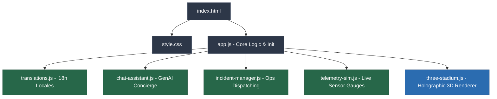
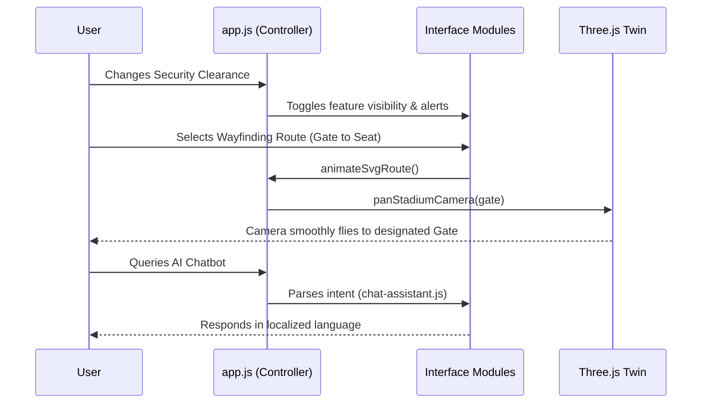

# StadiumAI — Holographic Digital Twin & Command Center

StadiumAI is a premium, fully interactive modular web application developed for stadium operations and the fan experience during the **FIFA World Cup 2026**. 

The app features a 3D hologram digital twin of the venue, a simulated GenAI multilingual chatbot assistant, real-time alert logs, incident dispatch systems, and security clearance modes, styled inside a modern glassmorphic dashboard inspired by modern developer themes.

---

## 🏗️ Architecture & Component Flowchart

The application is modularized at the root level using vanilla web technologies (HTML/CSS/JS) and does not require a build step. It ensures rapid deployment and high portability.



---

## ⚡ Key Features

1. **Holographic 3D Digital Twin**: Rendered using Three.js. Supports dynamic 3D visual layer toggling:
   - **Crowd**: Renders localized crowd density warnings in the stands (Red heatmap).
   - **Path**: Highlights dynamic seat routes in 3D using animated glowing neon tubes.
   - **Access**: Pinpoints handicap-accessible elevator locations and quiet sensory zones.
   - **Eco-Grid**: Visualizes active solar mesh modules on the roof structure.

2. **AI Fan Concierge**: A simulated GenAI chat console answering query topics (wheelchairs, plant-based foods, transit buses, carbon neutral stats, and gate directions) in multiple languages (English, Spanish, French). Dynamically parses intents and triggers UI state changes.

3. **Wayfinding Pathing Map**: An animated SVG pathing system showing precise gate-to-seat direction steps, calculated meters distance, and wheelchair accessibility details. The 3D camera tracks these changes to pan to the selected gate.

4. **Clean Operations Tracker**: Multi-gauge meters tracking solar yield, graywater recycling loops, waste diversion ratios, and offset tons of CO₂.

5. **Incident Command Console**: Interactive grid panel monitoring 8 stadium zones. Enables volunteer dispatches and remote HVAC cooling unit overrides.

6. **Tournament Schedule & Operations**: Displays a live match bracket with expected attendance figures and real-time statuses to ensure comprehensive **Tournament Operations** oversight.

7. **Security Clearance Viewports**: Dynamically adjusts interface access levels and permissions:
   - **Fan View**: standard seat wayfinding, food preorder, transit timetables, and chatbot.
   - **Volunteer View**: adds live incident logs, queue alarms, and crowd density alerts.
   - **Command VIP View**: grants administrative access to remote HVAC controls, field dispatches, grid audits, and DB telemetry feeds.

---

## 🔄 Interaction Flow



---

## 🚀 How to Run the Application

Since the files are written directly to the root of your workspace without a bundler, it is extremely easy to run:

### Option A: Local Browser Direct View
- Simply double-click the `index.html` file to open it in Chrome, Edge, Firefox, or Safari. All features (3D renderer, buttons, and switches) are fully active and clickable offline!

### Option B: Local Web Server
If you prefer running a local server for network sharing:
- Run using Node's serve utility:
  ```bash
  npx serve .
  ```
- Or run using Python's built-in HTTP server:
  ```bash
  python -m http.server 3000
  ```
  And navigate to `http://localhost:3000`.

---
*Developed for the Future of Smart Stadium Operations.*
